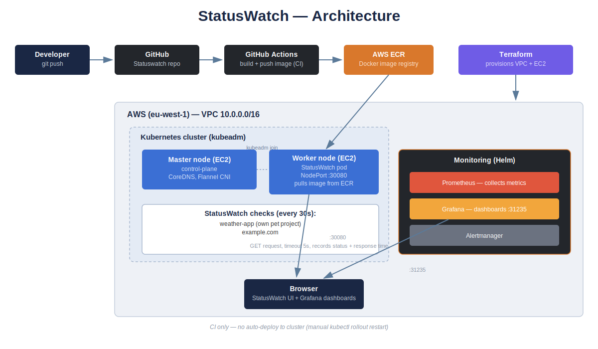

# StatusWatch

An uptime monitoring service that watches a list of websites and tells you — in
real time — which ones are up, which ones are down, and how fast they're
responding. Built end-to-end as a portfolio project: from a Flask app to a
real Kubernetes cluster running on AWS, with CI and monitoring.

📺 **Demo video:** _link coming soon (unlisted)_ — a full walkthrough of the project, including the reasoning behind each design decision.

> **Note:** the AWS infrastructure shown below was deployed, tested, and then
> torn down (`terraform destroy`) after the demo recording to avoid ongoing
> costs. The demo video is the best way to see it running live.



## What it does

- Checks a configurable list of target URLs every 30 seconds
- Serves a live status dashboard (`/`) showing UP/DOWN state and response time
- Exposes the same data as JSON (`/status`) and a health endpoint (`/health`)
  for use as a Kubernetes liveness/readiness probe

## Tech stack

| Layer | Tools |
|---|---|
| Application | Python 3.12, Flask, `requests`, `threading` |
| Containerization | Docker |
| Image registry | AWS ECR |
| Infrastructure | Terraform (VPC, EC2, Security Groups on AWS) |
| Orchestration | Kubernetes — self-managed cluster via **kubeadm** (not EKS) |
| Networking | Flannel CNI |
| CI | GitHub Actions — builds and pushes a new image to ECR on every push to `main` |
| Monitoring | Prometheus + Grafana, deployed via the `kube-prometheus-stack` Helm chart |

## Why kubeadm instead of EKS

This project is also a hands-on companion to CKA (Certified Kubernetes
Administrator) exam prep, so the cluster was deliberately built by hand with
`kubeadm` on plain EC2 instances rather than using a managed control plane.
That choice is also what surfaced a real, well-documented kubeadm issue on
Ubuntu (CoreDNS failing to resolve DNS because of a `systemd-resolved`
loopback quirk) — diagnosed and fixed by pointing kubelet at
`/run/systemd/resolve/resolv.conf`.

## What's automated and what isn't

- ✅ **CI:** every push to `main` builds a Docker image and pushes it to ECR
- ❌ **CD:** deploying a new image to the cluster is still a manual
  `kubectl rollout restart` — full GitOps-style continuous deployment is
  planned for a follow-up project using ArgoCD

## Running it locally

```bash
git clone https://github.com/Slavon777777777/Statuswatch.git
cd Statuswatch
python3 -m venv venv
source venv/bin/activate
pip install -r requirements.txt
python3 app.py
```

Then open `http://localhost:5000`.

Or with Docker:

```bash
docker build -t statuswatch:local .
docker run -p 5000:5000 statuswatch:local
```

## Known limitations

- Target checks run **sequentially**, not in parallel — fine for a handful
  of sites, but a slow/unresponsive target adds its full timeout (5s) to the
  whole check cycle. An async (`aiohttp`) or thread-pool implementation would
  be the next step to scale this up.
- Grafana has no persistent volume configured — its admin password and any
  custom dashboards reset if the pod is rescheduled. Fine for a demo
  environment, not for production.

## Roadmap

- [ ] Async/parallel target checking
- [ ] Persistent storage for Grafana
- [ ] Full CD (GitOps via ArgoCD) — planned as a separate project reusing
      this same cluster
